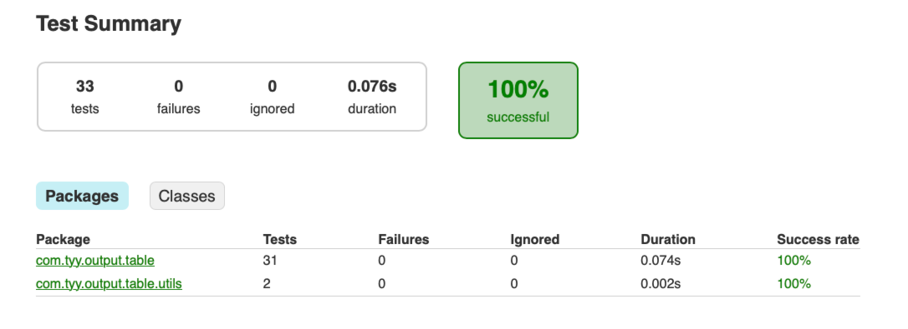

# 项目目标

构建一个Java AscII 表格输出。


# 功能

## 基本用法

### 方式一

使用 `addHeader` 和 `addData` 两个方法添加标题和数据，使用 `addTitleLine` 添加表格标题。

```java
Table table = new Table.Builder().build();
table.addTitleLine("This is a title");
table.addHeader("name", "age");
table.addData("name", "John");
table.addData("age", "25");
String[][] data = {{"Tom", "14"}, {"Mary", "16"}};
table.addData(data);
table.printInfo();
```

输出结果如下：

```bash
+-----------------+
| THIS IS A TITLE |
+--------+--------+
|  NAME  |  AGE   |
+--------+--------+
| John   | 25     |
| Tom    | 14     |
| Mary   | 16     |
+--------+--------+
```

### 方式二

可以使用 `Column.Builder` 进行更精确的构建。

```java
Table table = new Table.Builder().withTitle("My Table").build();
Column name = new Column.Builder().withHeader("name").withFooter("footer1").build();
Column age = new Column.Builder().withHeader("age").withFooter("footer2").build();
Column gender = new Column.Builder().withHeader("gender").withFooter("footer3").build();
table.addColumns(name, age, gender);
table.printInfo();
```

输出结果如下：

```java
+-----------------------------+
|          My Table           |
+---------+---------+---------+
|  NAME   |   AGE   | GENDER  |
+---------+---------+---------+
|         |         |         |
+---------+---------+---------+
| footer1 | footer2 | footer3 |
+---------+---------+---------+
```

## 添加标题

构建表时，可以通过 `withTitle` 添加表标题。

```java
Table table = new Table.Builder().withTitle("My Table").build();
table.addHeader("name", "age");
table.addData("name", "John");
table.addData("age", "25");
String[][] data = {{"Tom", "14"}, {"Mary", "16"}};
table.addData(data);
table.printInfo();
```

输出结果如下：

```bash
+------------+
|  My Table  |
+------+-----+
| NAME | AGE |
+------+-----+
| John | 25  |
| Tom  | 14  |
| Mary | 16  |
+------+-----+
```

## 添加多个标题

表构件器支持链式调用，支持使用 `withTitle` 创建多个标题。

```java
Table table = new Table.Builder().withTitle("Title1").withTitle("Title2").build();
table.addHeader("name", "age");
table.addData("name", "John");
table.addData("age", "25");
String[][] data = {{"Tom", "14"}, {"Mary", "16"}};
table.addData(data);
table.printInfo();
```

输出结果如下：

```bash
+------------+
|   Title1   |
+------------+
|   Title2   |
+------+-----+
| NAME | AGE |
+------+-----+
| John | 25  |
| Tom  | 14  |
| Mary | 16  |
+------+-----+
```

## 添加 footer

构建列时，可以通过 `withFooter` 指定列的 footer。

```java
Table table = new Table.Builder().withTitle("My Table").build();
Column name = new Column.Builder().withHeader("name").withFooter("footer1").build();
Column age = new Column.Builder().withHeader("age").withFooter("footer2").build();
Column gender = new Column.Builder().withHeader("gender").withFooter("footer3").build();
table.addColumns(name, age, gender);
table.printInfo();
```

输出结果如下：

```bash
+-----------------------------+
|          My Table           |
+---------+---------+---------+
|  NAME   |   AGE   | GENDER  |
+---------+---------+---------+
|         |         |         |
+---------+---------+---------+
| footer1 | footer2 | footer3 |
+---------+---------+---------+
```

## 设置行号

可以通过 `withRowNumbersEnabled` 设置是否显示行号

```java
// 构建表
Table table = new Table.Builder()
        .withTitle("My Table")
        .withRowNumbersEnabled(true)
        .build();
// 构建列
Column name = new Column
        .Builder()
        .withHeader("name")
        .withFooter("footer1")
        .build();
name.addCell("John").addCell("Mary").addCell("Bob");

Column age = new Column
        .Builder()
        .withHeader("age")
        .withFooter("footer2")
        .build();
age.addCell("25").addCell("30").addCell("40");

Column gender = new Column
        .Builder()
        .withHeader("gender")
        .withFooter("footer3")
        .build();
gender.addCell("Male").addCell("Female").addCell("Male");

// 打印
table.addColumns(name, age, gender);
table.printInfo();
```

输出结果如下：

```bash
+---------------------------------+
|            My Table             |
+---+---------+---------+---------+
|   |  NAME   |   AGE   | GENDER  |
+---+---------+---------+---------+
| 1 | John    | 25      | Male    |
| 2 | Mary    | 30      | Female  |
| 3 | Bob     | 40      | Male    |
+---+---------+---------+---------+
|   | footer1 | footer2 | footer3 |
+---+---------+---------+---------+
```

## 对齐

可以针对列设置对齐方式，目前支持的对齐方式如下：

1. 左对齐（`HorizontalAlign.LEFT`）；
2. 居中对齐（`HorizontalAlign.CENTER`）；
3. 右对齐（`HorizontalAlign.RIGHT`）；

可以针对列标题（`withHeaderAlign`）、列数据（`withDataAlign`）、列 footer（`withFooterAlign`） 进行设置，默认情况下，列标题是居中对齐；数据是左对齐；footer 是居中对齐。默认示例如下：

```java
Table table = new Table.Builder().withTitle("TITLE LINE 1").build();
Column name = new Column
		.Builder()
		.withHeader("name")
		.withFooter("foot1")
		.build();
name.addCell("John").addCell("Jane").addCell("Bob").addCell("Alice");

Column comment = new Column
	  .Builder()
	  .withHeader("Comment")
	  .withFooter("foot2")
	  .withHeaderAlign(HorizontalAlign.LEFT)
	  .build();
comment
    .addCell("This is a comment")
    .addCell("This is another comment")
    .addCell("This is a third comment")
    .addCell("This is a fourth comment");

table.addColumns(name, comment);
table.printInfo();
```

默认输出如下：

```bash

+----------------------------------+
|           TITLE LINE 1           |
+-------+--------------------------+
| NAME  |         COMMENT          |
+-------+--------------------------+
| John  | This is a comment        |
| Jane  | This is another comment  |
| Bob   | This is a third comment  |
| Alice | This is a fourth comment |
+-------+--------------------------+
| foot1 |          foot2           |
+-------+--------------------------+
```

### 左对齐

标题左对齐输出如下：

```bash
+----------------------------------+
|           TITLE LINE 1           |
+-------+--------------------------+
| NAME  | COMMENT                  |
+-------+--------------------------+
| John  | This is a comment        |
| Jane  | This is another comment  |
| Bob   | This is a third comment  |
| Alice | This is a fourth comment |
+-------+--------------------------+
| foot1 |          foot2           |
+-------+--------------------------+
```

### 右对齐

标题右对齐输入如下：

```bash
+----------------------------------+
|           TITLE LINE 1           |
+-------+--------------------------+
| NAME  |                  COMMENT |
+-------+--------------------------+
| John  | This is a comment        |
| Jane  | This is another comment  |
| Bob   | This is a third comment  |
| Alice | This is a fourth comment |
+-------+--------------------------+
| foot1 |          foot2           |
+-------+--------------------------+
```

### 居中对齐

数据居中对齐示例如下：

```bash
+-------+--------------------------+
| NAME  |         COMMENT          |
+-------+--------------------------+
| John  |    This is a comment     |
| Jane  | This is another comment  |
| Bob   | This is a third comment  |
| Alice | This is a fourth comment |
+-------+--------------------------+
| foot1 |          foot2           |
+-------+--------------------------+
```

## 控制最大宽度

支持设置每列的最大宽度，默认情况下，会自动计算列的最大宽度，可以通过 `withMaxWidth` 设置一个列的最大宽度。如果不指定溢出的处理行为，默认采用右侧省略。

```java
// 创建表
Table table = new Table.Builder().withTitle("TITLE LINE 1").withRowNumbersEnabled(true).build();

// 创建列
Column name = new Column
    .Builder()
    .withHeader("name")
    .withFooter("foot1")
    .build();
name.addCell("John")
  .addCell("Jane")
  .addCell("Bob")
  .addCell("Alice");

Column comment = new Column
    .Builder()
    .withHeader("Comment")
    .withFooter("foot2")
    .withMaxWidth(10)
    .build();
comment.addCell("This is a comment")
  .addCell("This is another comment")
  .addCell("This is a third comment")
  .addCell("This is a fourth comment");

// 打印
table.addColumns(name, comment);
table.printInfo();
```

默认输出如下：

```bash
+------------------------+
|      TITLE LINE 1      |
+---+-------+------------+
|   | NAME  |  COMMENT   |
+---+-------+------------+
| 1 | John  | This is a… |
| 2 | Jane  | This is a… |
| 3 | Bob   | This is a… |
| 4 | Alice | This is a… |
+---+-------+------------+
|   | foot1 |   foot2    |
+---+-------+------------+
```

### 左省略

`OverflowBehaviour#CLIP_LEFT` 表示益处的处理逻辑是左侧省略。

```java
// 创建表
Table table = new Table
    .Builder()
    .withTitle("TITLE LINE 1")
    .withRowNumbersEnabled(true)
    .withOverflowBehaviour(OverflowBehaviour.CLIP_LEFT)
    .build();

// 创建列
Column name = new Column
    .Builder()
    .withHeader("name")
    .withFooter("foot1")
    .build();
name.addCell("John")
  .addCell("Jane")
  .addCell("Bob")
  .addCell("Alice");

Column comment = new Column
    .Builder()
    .withHeader("Comment")
    .withFooter("foot2")
    .withMaxWidth(10)
    .build();
comment.addCell("This is a comment")
  .addCell("This is another comment")
  .addCell("This is a third comment")
  .addCell("This is a fourth comment");

// 打印
table.addColumns(name, comment);
table.printInfo();
```

输出结果如下：

```java
+------------------------+
|      TITLE LINE 1      |
+---+-------+------------+
|   | NAME  |  COMMENT   |
+---+-------+------------+
| 1 | John  | …a comment |
| 2 | Jane  | …r comment |
| 3 | Bob   | …d comment |
| 4 | Alice | …h comment |
+---+-------+------------+
|   | foot1 |   foot2    |
+---+-------+------------+
```

## 边框样式

默认提供四种边框风格，在构建表时通过 `withBorderStyle` 传递，除了四种默认风格外，还可以

传递一个长度不低于 28 的集合作为边框样式

1. `Character[]`；
2. `ImmutableList` ；
3. `List<Character>`；
4. `BorderStyle` 实例；

实例如下：

```java
// 创建表
Character[] borderStyles =
        "ABCDEFGHIJKLMNOPQRSTUVWXYZ123".chars().mapToObj(c -> (char) c).toArray(Character[]::new);
Table table = new Table
    .Builder()
    .withTitle("TITLE LINE 1")
    .withRowNumbersEnabled(true)
    .withBorderStyle(borderStyles)
    .withOverflowBehaviour(OverflowBehaviour.CLIP_LEFT)
    .build();

// 创建列
Column name = new Column
    .Builder()
    .withHeader("name")
    .withFooter("foot1")
    .build();
name.addCell("John")
  .addCell("Jane")
  .addCell("Bob")
  .addCell("Alice");

Column comment = new Column
    .Builder()
    .withHeader("Comment")
    .withFooter("foot2")
    .withMaxWidth(10)
    .build();
comment.addCell("This is a comment")
  .addCell("This is another comment")
  .addCell("This is a third comment")
  .addCell("This is a fourth comment");

// 打印
table.addColumns(name, comment);
table.printInfo();
```

输出结果如下：

```bash
ABBBBBBBBBBBBBBBBBBBBBBBBD
E      TITLE LINE 1      G
STTTCTTTTTTTCTTTTTTTTTTTTV
E   F NAME  F  COMMENT   G
STTTUTTTTTTTUTTTTTTTTTTTTV
E 1 F John  F …a comment G
E 2 F Jane  F …r comment G
E 3 F Bob   F …d comment G
E 4 F Alice F …h comment G
OPPPQPPPPPPPQPPPPPPPPPPPPR
E   F foot1 F   foot2    G
Z1112111111121111111111113
```

默认的其他风格如下

basic

```bash
+------------------------+
|      TITLE LINE 1      |
+---+-------+------------+
|   | NAME  |  COMMENT   |
+---+-------+------------+
| 1 | John  | …a comment |
+---+-------+------------+
| 2 | Jane  | …r comment |
+---+-------+------------+
| 3 | Bob   | …d comment |
+---+-------+------------+
| 4 | Alice | …h comment |
+---+-------+------------+
|   | foot1 |   foot2    |
+---+-------+------------+

```

FANCY

```bash
╔════════════════════════╗
║      TITLE LINE 1      ║
╠═══╤═══════╤════════════╣
║   │ NAME  │  COMMENT   ║
╠═══╪═══════╪════════════╣
║ 1 │ John  │ …a comment ║
║ 2 │ Jane  │ …r comment ║
║ 3 │ Bob   │ …d comment ║
║ 4 │ Alice │ …h comment ║
╟───┼───────┼────────────╢
║   │ foot1 │   foot2    ║
╚═══╧═══════╧════════════╝
```

FANCY2

```bash
╔════════════════════════╗
║      TITLE LINE 1      ║
╠═══╤═══════╤════════════╣
║   │ NAME  │  COMMENT   ║
╠═══╪═══════╪════════════╣
║ 1 │ John  │ …a comment ║
╟───┼───────┼────────────╢
║ 2 │ Jane  │ …r comment ║
╟───┼───────┼────────────╢
║ 3 │ Bob   │ …d comment ║
╟───┼───────┼────────────╢
║ 4 │ Alice │ …h comment ║
╟───┼───────┼────────────╢
║   │ foot1 │   foot2    ║
╚═══╧═══════╧════════════╝
```

## 控制数据显示行数

在创建表时可以通过 `withLimit` 控制显示的数据行数。

```java
// 创建表
Table table = new Table.Builder()
    .withTitle("TITLE LINE 1")
    .withRowNumbersEnabled(false)
    .withLimit(2)
    .build();

// 创建列
Column name = new Column.Builder()
    .withHeader("name")
    .withFooter("foot1")
    .withHeaderAlign(HorizontalAlign.RIGHT)
    .build();
name.addCell("John")
  .addCell("Jane")
  .addCell("Bob")
  .addCell("Alice");

Column comment = new Column.Builder()
    .withHeader("Comment")
    .withHeaderAlign(HorizontalAlign.CENTER)
    .withDataAlign(HorizontalAlign.CENTER)
    .withFooter("foot2")
    .build();
comment
    .addCell("This is a comment")
    .addCell("This is another comment")
    .addCell("This is a third comment")
    .addCell("This is a fourth comment");

// 打印
table.addColumns(name, comment);
table.printInfo();
```

输出结果如下：

```bash
+----------------------------------+
|           TITLE LINE 1           |
+-------+--------------------------+
|  NAME |         COMMENT          |
+-------+--------------------------+
| John  |    This is a comment     |
| Jane  | This is another comment  |
| …     |            …             |
+-------+--------------------------+
| foot1 |          foot2           |
+-------+--------------------------+
```

# 实现

## 表格抽象

### 表

- 边框
- 标题
- 行号

### 列

- 列名
- 数据
- 列 Footer

### Border

- 表格上边框
- 标题分割线
- 标题下边框
- 列名下边框
- 数据行分割线
- 表格下边框

### 数据

- 标题
- 列名
- 数据
- 页脚
